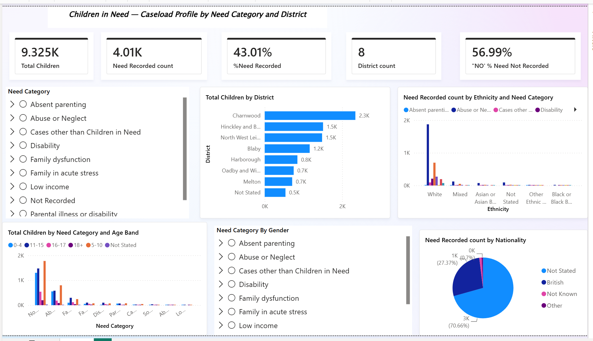

# Children in Need (CIN) Caseload Analysis

A Power BI dashboard analyzing Children in Need (CIN) census data across 8 Leicestershire districts, built to the Department for Education (DfE) CIN census framework.The project covers caseload distribution, need category breakdowns and demographic patterns to support safeguarding resource planning and data-quality monitoring.



## Data Privacy Note

This project uses an **anonymized extract of real local authority data**, modeled on the DfE CIN census structure.All personally identifiable information was removed prior to analysis — the working dataset contains only a non-identifying `Person Id` alongside demographic and need-category fields. Where a breakdown (e.g. ethnicity by district) produced a group of 5 or fewer children, that cell was suppressed following standard UK public sector statistical disclosure control practice, to prevent re-identification of individuals in small population subgroups.

## Business & Policy Context

Local authorities use CIN census data to plan safeguarding resources, monitor caseload pressure across districts, and identify gaps in data completeness that affect frontline decision-making. This dashboard turns a raw multi-field census extract into an interactive tool that a service manager or data lead could use to:

- Spot which districts carry disproportionate caseload
- See which need categories are most common, and how they vary by age band and gender
- Flag data-quality issues (e.g. incomplete need-category recording) that limit the reliability of downstream reporting

## Key Insights

- **9,325 children** recorded across 8 Leicestershire districts
- **Charnwood** carries the highest caseload at **2,340 children (25.1%)** — more than 3x the lowest recorded district, Melton (709 children, 7.6%)
- Only **43.0%** of records (4,011 of 9,325) have a confirmed recorded need category — a significant data-completeness gap that limits the reliability of any need-based breakdown
- Among children with a recorded need, **"Abuse or Neglect" is the largest category at 2,201 cases (54.9%)**, followed by "Family dysfunction" (796, 19.8%) and "Family in acute stress" (306, 7.6%)
- The **5–10 age band** is the largest group overall (3,102 children, 33.3%), followed by 11–15 (2,688) and 0–4 (2,121) — challenging an assumption that under-5s dominate the caseload
- **Nationality is the weakest-recorded field**: 70.7% of records with a need recorded still show "Not Stated" for nationality, versus 27.4% recorded as British — flagged as a priority data-quality issue for the source team
- Ethnicity data (where need is recorded) is heavily skewed to "White" (3,435, 85.6%), with several smaller ethnicity categories falling below the suppression threshold at district level

## Dashboard Views

| View | Description |
|---|---|
| Caseload Overview | KPI summary — total children, need-recorded rate, district count |
| Need Category & Sub-category | Drill-down tree filter across category/sub-category hierarchy |
| District Breakdown | Total children by district, ranked |
| Ethnicity × Need Category | Grouped bar chart of need-recorded counts by ethnicity |
| Age Band × Need Category | Clustered bar chart across age bands |
| Gender × Need Category | Drill-down tree filter by gender |
| Nationality | Proportional breakdown of need-recorded counts |

## Tools & Techniques

- **Power BI**: DAX measures for %Need Recorded, custom KPI cards, drill-down hierarchies (Need Category → Sub-category), cross-filtering across all visuals
- **Data cleaning**: parsed a 76-variant "category of need" field down to a consistent, DfE-aligned category/sub-category structure (17 clean fields in the final model: demographics, need classification, and district)
- **Data quality fixes**: resolved VLOOKUP and DATEVALUE errors from the source extract during pre-processing
- **Privacy**: small-cell suppression applied to any breakdown cell of 5 or fewer individuals
- **Excel**: PivotTables, INDEX/MATCH, COUNTIFS used in the pre-cleaning and validation stage before load into Power BI

See [`docs/methodology.md`](docs/Methodology.docx) for the full data-cleaning and DAX methodology, including exact measure formulas.

## Files in This Repo

```
├── powerbi/     → .pbix dashboard file
├── excel/       → cleaned workbook(s) used for pre-processing/validation
├── images/      → dashboard screenshots
├── docs/        → methodology and data-cleaning notes
└── data/        → data source and privacy notes
```


**Data Analyst**: Alabi Maryam Oyinkansola
**Tools**: Power BI · Excel · DAX
**Domain**: UK Children's Social Care / DfE CIN Census
